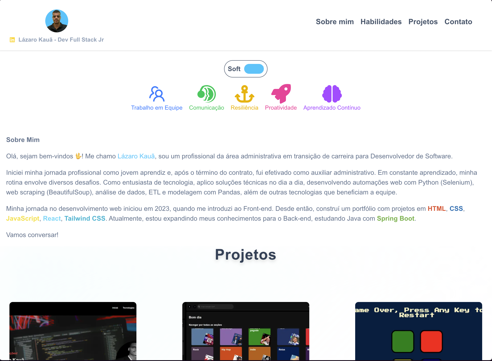

# My Personal Profile

Este é um projeto de página pessoal desenvolvido com Next.js, React e Tailwind CSS, apresentando meu portfólio, habilidades e formas de contato.

## ✨ Funcionalidades
- Apresentação pessoal
- Lista de projetos com imagens e links
- Seção de habilidades e stacks
- Contato via LinkedIn
- Layout responsivo e moderno

## 🚀 Tecnologias Utilizadas
- [Next.js](https://nextjs.org/)
- [React](https://react.dev/)
- [Tailwind CSS](https://tailwindcss.com/)
- TypeScript

## 📸 Demonstração


## 📂 Como rodar o projeto
1. Clone o repositório:
   ```bash
   git clone https://github.com/Lazarokaua/Pagina-Pessoal-maisPraTI
   ```
2. Instale as dependências:
   ```bash
   npm install
   ```
3. Rode o projeto localmente:
   ```bash
   npm run dev
   ```
4. Acesse: [http://localhost:3000](http://localhost:3000)

## 📱 Responsividade
O site é totalmente responsivo, adaptando-se a diferentes tamanhos de tela.

## 📬 Contato
Entre em contato pelo [LinkedIn](https://linkedin.com/in/lazarokaua).

---

Feito com 💙 por Lázaro Kauã
